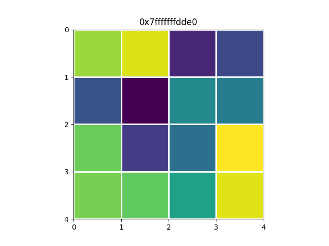

# eigengdb

This is a pretty printer for eigen types (with some support for stan-math types). Much of the logic comes from upstream eigen.
Formatting is handled by <span class="title-ref">numpy</span>.

## Motivation

Your debugging output shouldn't look like the following:

``` 
(gdb) p mat
$1 = {<Eigen::PlainObjectBase<Eigen::Matrix<double, 4, 4, 0, 4, 4> >> = {<Eigen::MatrixBase<Eigen::Matrix<double, 4, 4, 0, 4, 4> >> = {<Eigen::DenseBase<Eigen::Matrix<double, 4, 4, 0, 4, 4> >> = {<Eigen::DenseCoeffsBase<Eigen::Matrix<double, 4, 4, 0, 4, 4>, 3>> = {<Eigen::DenseCoeffsBase<Eigen::Matrix<double, 4, 4, 0, 4, 4>, 1>> = {<Eigen::DenseCoeffsBase<Eigen::Matrix<double, 4, 4, 0, 4, 4>, 0>> = {<Eigen::EigenBase<Eigen::Matrix<double, 4, 4, 0, 4, 4> >> = {<No data fields>}, <No data fields>}, <No data fields>}, <No data fields>}, <No data fields>}, <No data fields>}, m_storage = {m_data = {array = {
          0.68037543430941905, -0.21123414636181392, 0.56619844751721171, 0.59688006695214657,
          0.82329471587356862, -0.60489726141323208, -0.32955448857022196, 0.53645918962380801,
          -0.44445057839362445, 0.10793991159086103, -0.045205896275679502, 0.25774184952384882,
          -0.27043105441631332, 0.026801820391231024, 0.90445945034942565,
          0.8323901360074013}}}}, <No data fields>}
```

But rather, nicely formatted

``` 
(gdb) p mat
$1 = Eigen::Matrix<double,4,4,ColMajor> (data ptr: 0x7fffffffdde0)
[[ 0.68037543  0.82329472 -0.44445058 -0.27043105]
 [-0.21123415 -0.60489726  0.10793991  0.02680182]
 [ 0.56619845 -0.32955449 -0.0452059   0.90445945]
 [ 0.59688007  0.53645919  0.25774185  0.83239014]]

```

or through an interactive visualization as a plot, with values displayed when hovering on the cells

``` 
(gdb) imshow 0x7fffffffdde0
```



## Installation

python
import sys
import numpy as np
sys.path.insert(0, '/home/alfornasier/EigenGDB')
from printers import register_eigen_printers
register_eigen_printers(None)
#np.set_printoptions(threshold=sys.maxsize, linewidth=320, formatter={'float': lambda x: "{:5.2f}".format(x)})
np.set_printoptions(threshold=sys.maxsize, linewidth=320, formatter={'float': lambda x: "{:.2e}".format(x)})
end


Simply clone the repo, create a file `~/.gdbinit` file, that contains the following:
```
python
import sys
sys.path.insert(0, '/path/to/EigenGDB-matrix-visualization')
from printers import register_eigen_printers
register_eigen_printers(None)
end
```

## Usage

To plot multiple matrices at the same time give multiple addresses to the imshow command

``` 
(gdb) imshow addr1 addr2 addr3 ... addrN
```

## Customizing the printer

Since NumPy is used to render the matrix, you can adjust [NumPy's printing options](https://numpy.org/doc/stable/reference/generated/numpy.set_printoptions.html) in your gdb session to tweak the appearance. This can be done directly in gdb:

``` bash
(gdb) python
>import numpy as np
>np.set_printoptions(linewidth=200, formatter={'float': lambda x: "{:5.2f}".format(x) if x !=0 else "     "})
>end
(gdb) p lin_invar_pref
$12 = Eigen::Matrix<double,4,12,ColMajor> (data ptr: 0x613000001380)
[[ 1.00  0.32  1.05  0.05  1.32 -0.22 -0.17 -0.12 -0.07 -0.02  0.03  0.19]
 [       1.00  0.19  0.19  1.00 -0.84 -0.65 -0.46 -0.27 -0.08  0.11  0.33]
 [             1.00  1.00  0.00 -0.22  0.78  1.78  2.78  3.78  4.78 -0.44]
 [                               0.40  0.40  0.40  0.40  0.40  0.40  0.80]]
```

or permanetly in the `~/.gdbinit` file:
```
python
import sys
sys.path.insert(0, '/path/to/EigenGDB-matrix-visualization')
from printers import register_eigen_printers
register_eigen_printers(None)
np.set_printoptions(linewidth=200, formatter={'float': lambda x: "{:5.2f}".format(x) if x !=0 else "     "})
end
```

## Credits

 - Original version: [libeigen](https://gitlab.com/libeigen)
 - Formatting handled by numpy: [eigengdb](https://github.com/dmillard/eigengdb)

## License

EigenGDB-matrix-visualization is licensed under MPL2.0.

